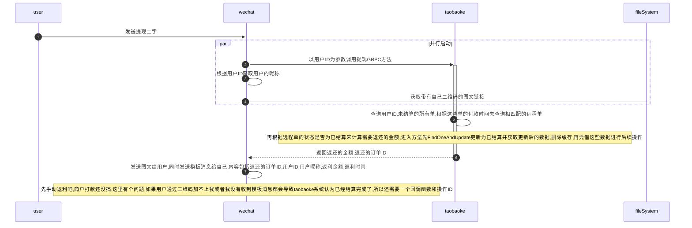

```mermaid
sequenceDiagram
autonumber
user ->>+ wechat : 发送提现二字
par 并行启动 
wechat ->>+ taobaoke : 以用户ID为参数调用提现GRPC方法
wechat  -> wechat : 根据用户ID获取用户的昵称
wechat -> fileSystem : 获取带有自己二维码的图文链接
end
taobaoke -> taobaoke : 查询用户ID,未结算的所有单,根据这些单的付款时间去查询相匹配的远程单
note over taobaoke : 再根据远程单的状态是否为已结算来计算需要返还的金额,进入方法先FindOneAndUpdate更新为已结算并获取更新后的数据,删除缓存,再凭借这些数据进行后续操作
taobaoke -->>- wechat : 返回返还的金额,返还的订单ID


wechat -> wechat : 发送图文给用户,同时发送模板消息给自己,内容包括返还的订单ID,用户ID,用户昵称,返利金额,返利时间
note over wechat : 先手动返利吧,商户打款还没搞,这里有个问题,如果用户通过二维码加不上我或者我没有收到模板消息都会导致taobaoke系统认为已经结算完成了,所以还需要一个回调函数和操作ID
```