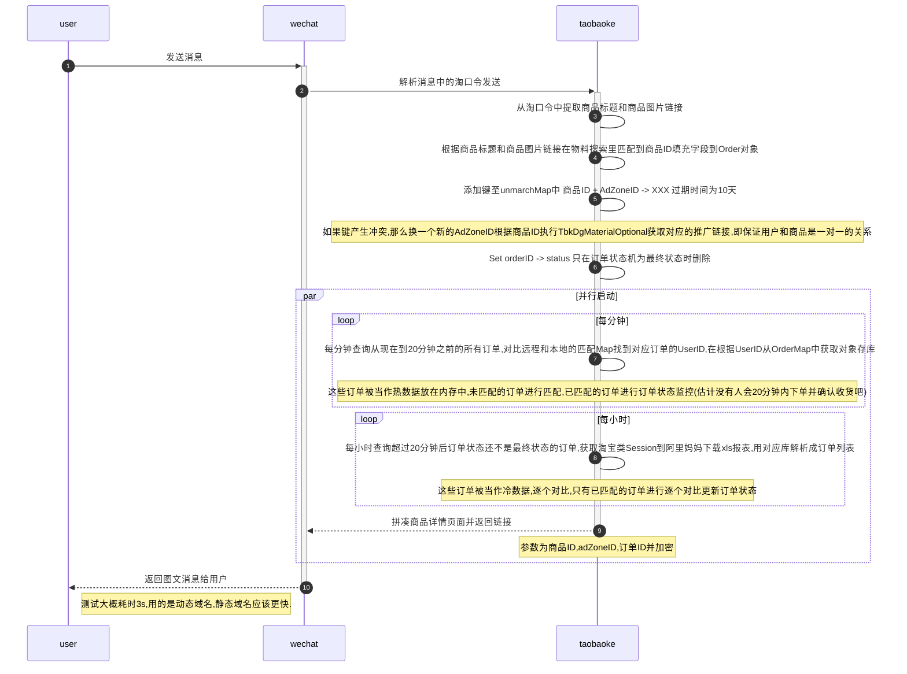

```mermaid
sequenceDiagram
autonumber
user ->>+ wechat : 发送消息
wechat ->>+ taobaoke : 解析消息中的淘口令发送
taobaoke ->taobaoke : 从淘口令中提取商品标题和商品图片链接
taobaoke ->taobaoke : 根据商品标题和商品图片链接在物料搜索里匹配到商品ID填充字段到Order对象
taobaoke -> taobaoke :添加键至unmarchMap中 商品ID + AdZoneID -> XXX  过期时间为10天
note over taobaoke : 如果键产生冲突,那么换一个新的AdZoneID根据商品ID执行TbkDgMaterialOptional获取对应的推广链接,即保证用户和商品是一对一的关系
taobaoke -> taobaoke :Set orderID -> status  只在订单状态机为最终状态时删除
par 并行启动
loop 每分钟
taobaoke ->taobaoke : 每分钟查询从现在到20分钟之前的所有订单,对比远程和本地的匹配Map找到对应订单的UserID,在根据UserID从OrderMap中获取对象存库
note over taobaoke : 这些订单被当作热数据放在内存中,未匹配的订单进行匹配,已匹配的订单进行订单状态监控(估计没有人会20分钟内下单并确认收货吧)
end
loop 每小时
taobaoke ->taobaoke: 每小时查询超过20分钟后订单状态还不是最终状态的订单,获取淘宝类Session到阿里妈妈下载xls报表,用对应库解析成订单列表
note over taobaoke : 这些订单被当作冷数据,逐个对比,只有已匹配的订单进行逐个对比更新订单状态
end
taobaoke -->>- wechat : 拼凑商品详情页面并返回链接
note over taobaoke : 参数为商品ID,adZoneID,订单ID并加密
end
wechat -->>- user : 返回图文消息给用户
note right of  user : 测试大概耗时3s,用的是动态域名,静态域名应该更快.
```